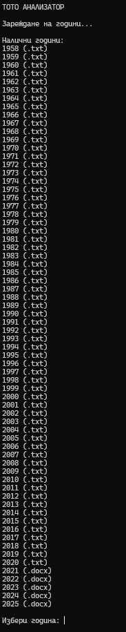
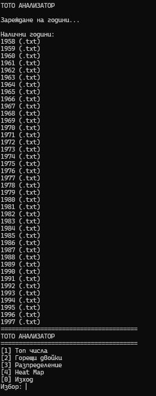
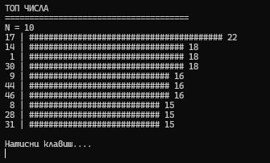
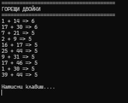
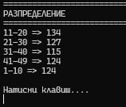
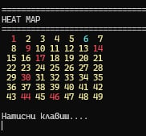
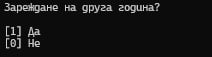

# 🎯 Toto Analyzer (.NET 8)

## 📌 Описание

Toto Analyzer е конзолно приложение, разработено на C# и .NET 8, предназначено за статистически анализ на исторически данни от играта „Тото 6/49“ на Български Спортен Тотализатор.

Приложението автоматично изтегля реални исторически данни от toto.bg чрез HTTP заявки, обработва TXT и DOCX файлове и извършва различни статистически анализи чрез LINQ.

---

# 👨‍💻 Разработчик

Aleksandar Novoselski  
South West University  
Faculty Number: 23251421027

---

# ⚙️ Основни функционалности

✅ Автоматично изтегляне на данни чрез HttpClient  
✅ Поддръжка на TXT файлове  
✅ Поддръжка на DOCX файлове  
✅ Автоматичен избор на parser  
✅ Статистически анализ чрез LINQ  
✅ Топ N най-чести числа  
✅ Анализ на „горещи двойки“  
✅ Разпределение по диапазони  
✅ ASCII bar chart визуализация  
✅ Heat Map визуализация  
✅ Интерактивно конзолно меню  
✅ Input validation  
✅ Error handling  

---

---

# 📸 Снимки на приложението

## 1. Главно меню



---

## 2. Зареждане на година



---

## 3. Top N Numbers



---

## 4. Hot Pairs



---

## 5. Distribution



---

## 6. Heat Map



---

## 7. Желаете ли да изберете друга година




# 🏗 Архитектура на проекта

Проектът е разделен на отделни слоеве:

```text
Models
Data
Parsers
Services
Visualization
UI
Helpers

---
